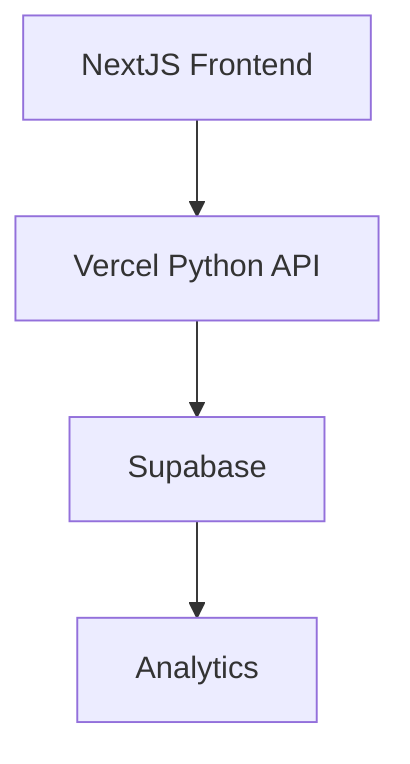
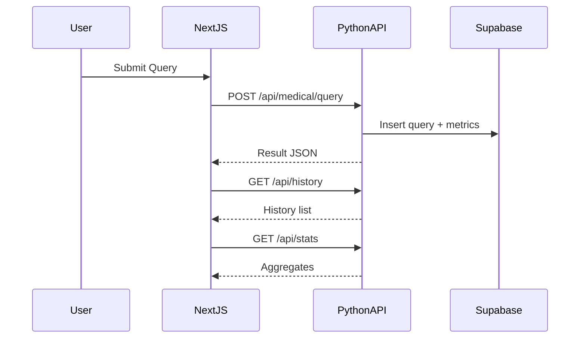

# Next.js/React 前端迁移与数据库存储实施方案

## 目标与范围
- 将现有 Streamlit 前端迁移为 Next.js/React，在 Vercel 上一体化部署。
- 后端 API 继续使用 Python（Vercel Serverless Functions）。
- 历史、统计、画像与安全事件统一改为数据库存储（Supabase）。

## 总体架构

## 数据流与页面映射

## 数据库设计（Supabase/Postgres）
- 表：`queries`
  - `id` (PK, uuid)
  - `timestamp` (timestamptz)
  - `user_id` (nullable, text)
  - `symptom` (text)
  - `patient_info` (jsonb)
  - `status` (text)
  - `disease_name` (text)
  - `advice` (jsonb)
  - `urgency` (text)
  - `server_duration_ms` (int)
  - `total_duration_ms` (int)
  - `supplementary_info` (jsonb)  // candidates、multi_analysis、confidence
  - `model` (text)
  - `source_channel` (text)
  - 索引：`idx_queries_timestamp`, `idx_queries_status`, `idx_queries_user`
- 表：`security_events`
  - `id` (PK, uuid)
  - `query_id` (uuid, FK)
  - `risk_score` (int)
  - `high_risk_matches` (jsonb)
  - `medium_risk_matches` (jsonb)
  - `is_medical` (bool)
  - `llm_confidence` (int)
  - 索引：`idx_security_query`
- 可选表：`aggregates_daily`（用于离线汇总）

## 前端迁移计划（Next.js/React + Vercel）
- 创建项目
  - `pnpm create next-app@latest`（启用 TypeScript、ESLint、App Router）
  - 项目结构：`app/` 或 `pages/`；组件：`components/QueryForm`、`AdvicePanel`、`HistoryList`、`StatsPanel`
- 环境变量
  - `NEXT_PUBLIC_API_BASE`：后端 API 基址（Vercel Python 或外部域名）
- 页面与路由
  - `/`：症状提交与建议展示（表单、loading、错误态）
  - `/history`：查询历史列表与详情（分页、删除）
  - `/stats`：统计指标（count/avg/p95/max）与画像（年龄段、概率）
- 数据获取
  - 使用 `fetch`/`SWR`：客户端渲染 + 轻量缓存；必要时 SSR/ISR（例如 `/stats`）
- UI 与交互
  - 表单提交携带 `client_start_ts`；结果页渲染 `advice`、`supplementary_info`（probabilities、best_candidate）
  - 历史页展示耗时、状态、候选分布；支持删除与刷新
- 部署
  - `pnpm vercel` 预览；`pnpm vercel --prod` 生产

## 后端与数据库集成（Python Serverless）
- 连接 Supabase（推荐使用 `supabase-py`；服务端仅使用 Service Role Key）
  - 环境变量：`SUPABASE_URL`、`SUPABASE_SERVICE_ROLE_KEY`
  - 在 `api/medical_query.py` 写入 `queries` 与可选 `security_events`
- 端点与职责
  - `POST /api/medical/query`：处理业务、写入 `queries`、返回结果
  - `GET /api/history`：分页查询 `queries`（按时间倒序）
  - `GET /api/stats`：实时聚合（status 计数，耗时分布）
- 迁移策略
  - 逐步将文件落盘改为 DB 写入；保留本地文件作为降级与回滚

## 任务清单（详尽）
1. 初始化 Next.js 项目
   - 输入：Node、pnpm
   - 输出：Next.js 代码骨架
   - 依赖：Vercel 账号
   - 成本：低
   - 收益：前端基础搭建
   - ROI：高
   - 进度：0%
   - 验收：项目可本地启动
2. 设计数据库与创建实例（Supabase）
   - 输入：ER 设计
   - 输出：`queries`、`security_events` 表
   - 依赖：Supabase 项目与密钥
   - 成本：中
   - 收益：统一存储与统计
   - ROI：中高
   - 进度：0%
   - 验收：能连接并插入/查询（REST/SDK）
3. 改造后端 API 写入 DB
   - 输入：现有 `controllers/medical_controller.py`
   - 输出：写库逻辑、查询与统计端点
   - 依赖：`SUPABASE_URL`、`SUPABASE_SERVICE_ROLE_KEY`
   - 成本：中
   - 收益：持久化与查询统一
   - ROI：中高
   - 进度：0%
   - 验收：调用成功并写入 DB
4. 前端页面实现 `/` `/history` `/stats`
   - 输入：API 文档
   - 输出：React 组件与数据流
   - 依赖：API 可用
   - 成本：中
   - 收益：用户体验提升、可部署
   - ROI：高
   - 进度：0%
   - 验收：功能完整、状态与耗时可见
5. 部署与域名
   - 输入：Vercel 项目
   - 输出：公网地址
   - 依赖：Vercel、环境变量
   - 成本：低
   - 收益：对外可用
   - ROI：高
   - 进度：0%
   - 验收：健康检查与主要功能通过
6. 监控与日志
   - 输入：调用链
   - 输出：端到端耗时、LLM分时记录（DB）
   - 依赖：API 写入
   - 成本：低
   - 收益：可观测性与优化依据
   - ROI：高
   - 进度：0%
   - 验收：统计页展示指标

## 优先级与里程碑
- 优先级（紧急且重要）
  - 数据库创建与连接（2）
  - 后端写库与读取（3）
  - 首页查询与建议展示（4部分）
- 里程碑
  - M1：DB 与 API 写库打通
  - M2：前端首页上线
  - M3：历史/统计上线
  - M4：正式生产发布与观察

## 环境与变量
- 前端：`NEXT_PUBLIC_API_BASE`
- 后端：`DEEPSEEK_API_KEY`、`DEEPSEEK_API_URL`、`DEEPSEEK_MODEL`、`TEMPERATURE`、`MAX_TOKENS`、`SUPABASE_URL`、`SUPABASE_SERVICE_ROLE_KEY`

## 验收标准
- 前端三页功能完整（查询、历史、统计），交互稳定。
- API 写库成功，历史与统计查询正确。
- 端到端耗时与 P95、Max 可在统计页直观展示。

## 回滚与降级
- API 保留文件写入降级路径（本地/内网），DB不可用时快速切换。
- 前端不可用时，保留 Streamlit 作为临时入口。
