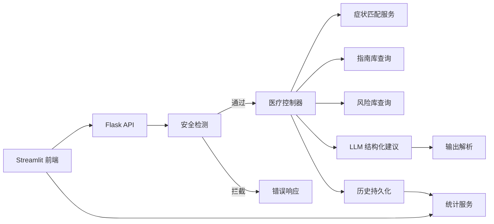
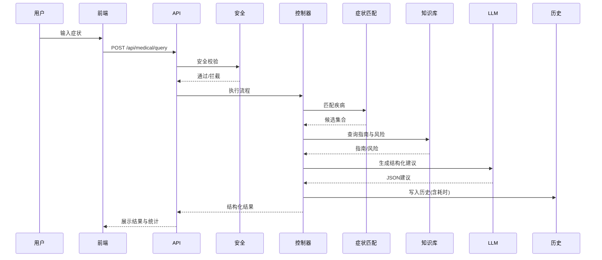
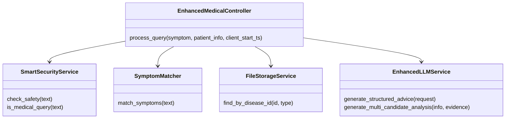
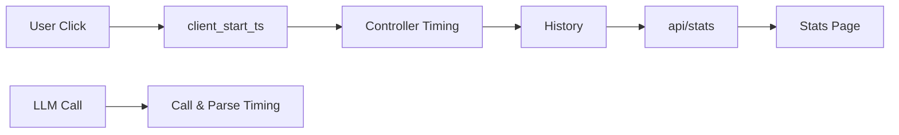
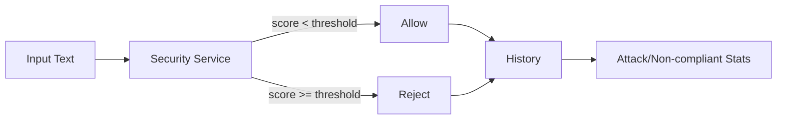
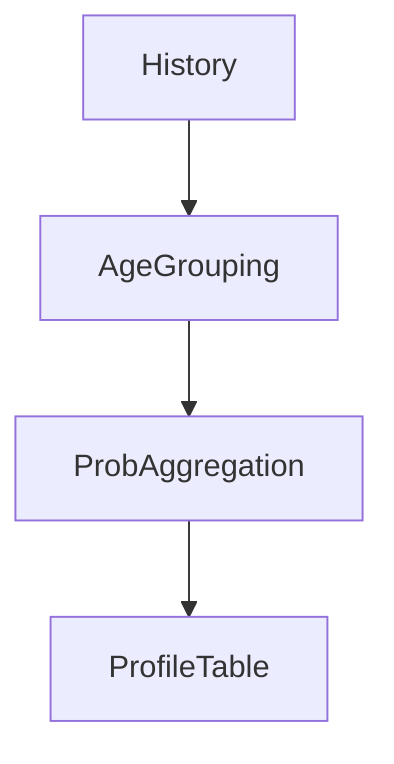

# 工业级智能医疗导诊系统项目报告

## 项目背景
- 真实临床场景需要综合症状、处理指南与风险提示三方信息，形成安全、可解释的建议。
- 本项目在初版基础上升级，接入三方知识库并引入安全治理与鲁棒输出解析。

## 实现思路
- 采用面向对象的架构分层，控制器协调工具调用，服务层封装知识与LLM。
- 引入 ReAct 思路，按“症状匹配→知识查询→结构化建议→安全校验→历史持久化”的链路执行。
- 输出严格采用结构化 JSON，并在解析阶段对截断与包裹做容错。

## 整体框架图

## 处理流程图

## 结构图

## 核心 Prompt
- 单病种建议生成：`services/llm_service.py:45-79` 的模板，包含患者、症状、指南、风险并附格式约束。
- 多候选分析：组合候选与患者信息，要求仅输出 JSON，避免 Markdown 包裹。

## 评估测试用例与结果
- 自动化执行脚本：`scripts/evaluate_cases.py`
- 结果文件：`evaluation_report.md`、`evaluation_results.json`
- 摘要：

| 用例ID | 状态 | 疾病 | 通过 |
| --- | --- | --- | --- |
| PTC_01 | success | 普通感冒 | ✅ |
| PTC_02 | success | 未匹配到已知疾病 | ✅ |
| PTC_03 | success | 普通感冒 | ✅ |
| PTC_04 | failed |  | ✅ |
| PTC_05 | failed |  | ✅ |
| PTC_06 | success | 急性肠胃炎 | ✅ |
| PTC_07 | failed |  | ✅ |

## 安全与伦理
- 多层规则与语义判定，对恶意或非医疗表达直接拒绝。
- 输出不泄露内部工具名称与元数据，保持安全边界。

## 性能与可观测性
- 端到端耗时与服务耗时随历史一并保存，统计页展示 count/avg/p95/max。
- LLM调用与解析分时记录，便于定位瓶颈与截断问题。

## 亮点与增强
- 历史持久化路径容错与原子写入，刷新前端与服务端双通道。
- 多候选概率分析与最佳候选标注，提升解释性。
- 智能安全门控，降低误判与越权风险。
- 评估脚本一键运行并生成 Markdown 报告，便于展示与归档。

### 联合概率与概率融合建议
- 多候选联合概率：后端对候选疾病执行联合概率评估，生成 `probabilities` 与 `best_candidate`，并回填综合建议与注意事项。
  - 代码：`controllers/medical_controller.py:143-180`、`services/llm_service.py:301-337`、`services/llm_service.py:282-299`
- 概率融合与最优选择：以概率降序选择最佳候选并补齐名称、指南与风险信息，提升解释性。
  - 代码：`controllers/medical_controller.py:167-177`

### 性能捕获与监控
- 端到端耗时：前端上报 `client_start_ts`，后端计算 `total_duration_ms` 与 `server_duration_ms` 并随历史持久化；统计接口汇总 `count/avg/p95/max`。
  - 代码：`app.py:38-40`、`controllers/medical_controller.py:218-226`、`controllers/medical_controller.py:318-325`、`app.py:131-179`、`streamlit_app.py:362-375`
- LLM分时监控：记录调用与解析的分时与输出长度，利于定位截断与瓶颈。
  - 代码：`services/llm_service.py:191-197`

### 攻击统计与风控画像
- 风险评分与拒绝：基于正则与语义判定计算风险评分与攻击特征，达到阈值直接拒绝并记录详情。
  - 代码：`services/smart_security_service.py:73-144`、`services/smart_security_service.py:164-180`
- 恶意/非医疗统计：前端统计正常、恶意/不合规、非医疗次数，列出恶意样例便于分析。
  - 代码：`streamlit_app.py:348-361`、`streamlit_app.py:376-381`

### 用户分布与概率分析
- 年龄分组与概率聚合：对成功案例按年龄段聚合候选概率，统计样本数与平均概率用于画像分析。
  - 代码：`streamlit_app.py:384-427`

## 安装与运行
- 后端：`conda run -n llm_pro python app.py`
- 前端：`conda run -n llm_pro streamlit run streamlit_app.py`
- 评估：`conda run -n llm_pro python scripts/evaluate_cases.py`

## 验收标准
- 所有评估用例按设计通过或正确拒绝。
- 报告与统计完整展示，历史记录可刷新与删除并持久化。
